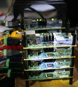
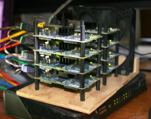
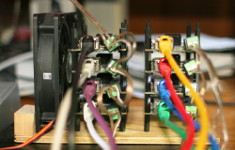
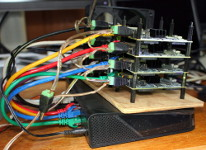
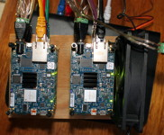

<!-- 
.. title: Building A Parallella Cluster
.. slug: building-a-parallella-cluster
.. date: 2017-01-02 20:56:00 UTC-05:00
.. tags: parallella, epiphany, zynq, MPI, Ansible
.. category: 
.. link: 
.. description: 
.. type: text
-->

I finally got around to assembling my small pile of Parallella boards into a cluster.

[](../../2016/parallella_cluster_side_top_lg.jpg)

This post documents the choices I made about power distribution, mechanical assembly, cooling, software management, etc.
For background on the individual boards, see my previous post:
[Introduction to Parallella](https://markdewing.github.io/blog/posts/introduction-to-parallella/).


The software directions are based on the Linaro 14.04 image.
(At some point I should upgrade to the latest Paraubuntu release.)

## Power
There are several options for powering multiple boards:

1. Solder a jumper and use the mounting pads with metal standoffs to transmit the power.  This option requires the fewest cords.
2. Use micro USB connector (need to switch jumper J14).  There are multi-port USB power supplies that should work.  This is probably the simplest option for a small number of boards.
3. Use the 5.5mm barrel plug (default settings).  There are versions with screw terminals on Amazon ([these](https://www.amazon.com/gp/product/B00VESYK0S/) for example).

I went with option 3 and used an old PC power supply for the power.

## Mechanical assembly
I used [20mm nylon standoffs](https://www.amazon.com/gp/product/B013G1Q300/) and assembled the boards into two stacks.
A small piece of 1/4" plywood was used for the base.

## Cooling
For air flow, I used a cooling fan from an old PC and mounted it to the plywood base.

## Network
Needing ports for a maximum of 10 boards, plus one port for the external connection, I chose a [16-port Gigabit D-Link switch](https://www.amazon.com/gp/product/B0092KZBCQ/).
Eventually I would like to power the network switch from the PC power supply, but need to get the right plug first.

The nodes use DHCP from my home network get their addresses.
A future improvement is to run a DHCP server on one node and use that to supply addresses to the other nodes.
This would make the cluster independent of running on my home network.

## MicroSD cards
Follow the directions on the Parallella [Create SD Card](http://www.parallella.org/create-sdcard/) page.
After burning the image, use `gparted` to resize the partition to the full capacity of the card.


## Management and control
Performing software installs and other management on all of boards individually would be too tedious.
There are many solutions for managing clusters.
I decided to use [Ansible](http://docs.ansible.com/ansible/intro_getting_started.html), as it seemed the simplest (no software needed on nodes) and it runs over ssh.

In addition to controlling operations from a PC, it is useful to designate one node as a 'head node' and install Ansible there as well.
For MPI, it's easier to run MPI programs from the head node than from the PC.
For setting up configuration files, it can be useful to create or edit the file and make sure it works on one node, and then copy the file to all the other nodes.

Ansible and MPI (and general convenience) require setting up [passwordless ssh login](http://www.tecmint.com/ssh-passwordless-login-using-ssh-keygen-in-5-easy-steps/).
<!--Some directions to set up [ssh passwordless login](http://www.tecmint.com/ssh-passwordless-login-using-ssh-keygen-in-5-easy-steps/)-->

Once the keys are set up locally, you can use `ssh-copy-id` to copy the credentials.
```
ssh-copy-id -i ~/.ssh/id_rsa.pub parallella@10.0.0.145
```

I keep a small script that puts this line in the history (named `ssh_copy_id`)
```
history -s "ssh-copy-id -i ~/.ssh/id_rsa.pub parallella@10.0.0.145"

```

Run the command `source ssh_copy_id` to put the command on the history list.
Use the bash history and line editing features to select the command and update to a new address.

Rather than create a new user, I'm using the default 'parallella' user on the nodes.
The SSH config (in '.ssh/config') can be set up to switch users upon login.
```
Host 10.0.0.127
    User parallella
```

You might wish to [set up a apt-cache server](http://www.tecmint.com/apt-cache-server-in-ubuntu/) on a local machine to save on download bandwidth when installing software to all the nodes.
<!--[Some directions here](http://www.tecmint.com/apt-cache-server-in-ubuntu/)-->

### Using Ansible

See the [intro docs](http://docs.ansible.com/ansible/intro_getting_started.html).

The inventory file is a list of IP addresses (one per line).     It can be specified on the command line
with `-i'.  To see if all the nodes work
```
ansible -i cluster.ini all -m ping
```

To copy the apt-cache server configuration to all the nodes, use
```
 ansible -i hosts all --sudo -m copy -a "src=/etc/apt/apt.conf.d/02proxy dest=/etc/apt/apt.conf.d/02proxy"
```

To shutdown all the nodes, use
```
ansible -i cluster.ini all --sudo -m shell -a "shutdown now"
```


## Compilation
In the [introductory post](https://markdewing.github.io/blog/posts/introduction-to-parallella/) I talked about cross compiling for the board.
That gets more complicated with larger software packages.
For instance, one of my project dependencies, HDF, doesn't cross-compile easily (or at all). 

Since the nodes use a regular Ubuntu distribution, native compilation is easy, but slow.

One solution is to use [distcc](https://github.com/distcc/distcc).  

The particular software package I'm working with (QMCPACK, which does simulations on atoms, molecules, and solids)
uses CMake for configuration and build, and builds fine with distcc.


Install on all nodes with 
```
ansible -i cluster.ini all --sudo  -a "apt-get install -y distcc"
```

Set the `DISTCC_HOSTS` variable to the set of systems to use
```
export DISTCC_HOSTS="localhost @10.0.0.144/2 @10.0.0.145/2"
```
This example shows three hosts. The initial '@' means to use ssh (no daemon required on remote) and the '/2' on the end means to use two threads.

Now set the C and C++ compilers to `distcc <compiler>` and run the build.

For CMake, building a project with MPI, this is
```
export CC="distcc mpicc"
export CXX="distcc mpic++"
```
Then
```
make -j 8
```

You might see an warning message 
```
distccd[<pid>] (tcp_cork_sock) Warning: setsockopt(corked=1) failed: Socket operation on non-socket
```
This can be ignored.  Or follow some directions to [silence it](https://jeffreywildman.wordpress.com/2011/02/11/disable-tcp_cork_sock-warnings-when-using-distcc-over-ssh/).

## MPI

One popular method for writing programs that communicate across the boards is [MPI (Message Passing Interface)](https://computing.llnl.gov/tutorials/mpi/).

Install the 'mpi-default-dev' package (which should also install the 'mpi-default-bin' package).
This installs the Open MPI implementation (the alternative being MPICH).
Note that this MPI is only concerned with communication between the ARM cores on different boards.
There is also the Brown Deer Technology version of MPI for programming the Epiphany accelerator.

It's common to use a networked file system so each local node has access to the executables and input files.
Ansible has file distribution commands that work well enough that a networked file system isn't strictly necessary.
(Be aware when copying directories with Ansible that if the directory specified in `src` does not end with '/', the directory and it's contents are copied.  If it does end with '/', just the directory contents are copied.)

Open MPI uses a tree-based launcher for better scalable start-up performance.  Because of this, each node should
be able to log into each other node (not just head node to other nodes).

MPI needs a list of machines to run on.  One method is to create a host file and pass it to `mpirun` with the `--hostfile` option.  The host file, at its simplest, is one hostname or IP address per line (same as a simple Ansible inventory file.)

## Gallery

[](../../2016/parallella_cluster_front_side_lg.jpg)   &nbsp;
[](../../2016/parallella_cluster_back_view_lg.jpg)  &nbsp;

[](../../2016/parallella_cluster_side_lg.jpg)  &nbsp;
[](../../2016/parallella_cluster_top_lg.jpg) &nbsp;
[](../../2016/parallella_cluster_side_top_lg.jpg)
