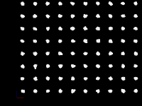

<!-- 
.. title: Visualizing MD Data
.. slug: visualizing-md-data
.. date: 2015-12-08 22:14:00 UTC-06:00
.. tags: vispy, CoMD
.. category: 
.. link: 
.. description: 
.. type: text
-->

Visualizing atomic positions in 3D is useful when working on a molecular dynamics code.

More generally, being able to visualize the structures and algorithms inside a code can help with understanding
and debugging.
With all the advances in graphics hardware, it should be possible to quickly create visualizations for various
aspects of the code.
But this seems harder than it should be.
In this particular case, normal plotting packages can sometimes plot atomic positions with 3D scatter plots.
But then further algorithm visualization is hard (animation, drawing boxes, etc).

The [VisPy](http://vispy.org/VisPy) project looks promising.
It contains three API levels 

1. `gloo`- the lowest level API around OpenGL
2. `scene`- uses a scene graph description
3.  `plot` - standard plotting interface

The 'scene' interface is the appropriate abstraction level for our purposes.
Note this API is marked experimental and may change in the future.

## Pretty pictures
Static screenshots (click for larger version)

And an animation (click for larger version)

## Code
The modified `comd.py` is [here](https://gist.github.com/markdewing/28223759c2dbe24e1147).
It should be a drop-in replacement for that file in the [`nsquared`](https://github.com/markdewing/multitevo/tree/master/CoMD/python/nsquared) version of the code.  The bulk of the visualization additions start around line 154.

The perceived speed of the simulation can vary.  Pure Python, even at the smallest system size, is too slow.
Using the [Numba-accelerated](http://markdewing.github.io/blog/posts/first-performance-improvements/) loop makes it much faster.
However, for the smallest system, this feels 'too fast'.
Increasing the system size will slow it down (`-x 6 -y 6 -z 6' seems to work well on my system).
There are much better ways of adjusting the speed, but this is the most expedient.

The `-N` option specifies the number of steps (defaults to 100).  Set it to a larger value to run the animation longer.

During the run, press `s` to take a static screenshot (stored in `screenshot.png`).  Press 'a' key to start/stop saving
an animated segment (stored in `animation.gif`).   These features require that the `imageio` package is installed.

The `multiprocessing` package is used to run the simulation and the visualization event loop in separate processes.
Positions are passed from the simulation to the visualization via a Queue.
A Timer on the visualization side checks the queue for new positions periodically.

This code snippet uses the Marker visual element to display the center of each point.
This size is the size of the element on the screen, not the size in the scene (that is, elements don't change size when zooming)
The current size was chosen to easily see the motion of the atoms, not to accurately represent the atom's size.
Displaying a Sphere at each point would be more accurate, but is much slower.

## Summary
I'm very pleased with VisPy.  It enabled live, interactive animation of atoms from a molecular dynamics code with
 a small amount code.
I expect extending this to visualize more complex algorithms and data structures should be be straightforward.

